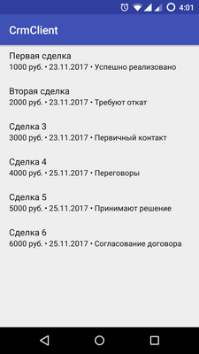

# CrmClient

Simple Android CRM client.

Connects to REST API and displays list of leads with basic info (status names come from separate API endpoint).

Implements MVP design pattern. Written in three days as a test task.

## Technologies used

- [Dagger](https://google.github.io/dagger/)
- [Gson](https://github.com/google/gson)
- [Retrofit](http://square.github.io/retrofit/)
- [RxJava](https://github.com/ReactiveX/RxJava) + [RxAndroid](https://github.com/ReactiveX/RxAndroid)

## Installation

This is an Android Studio project. XML resource file with credentials (subdomain, login, hash) is not included.

## License

Project is distributed under MIT license.

Third-party libraries are distributed under their own terms, please see their websites.
